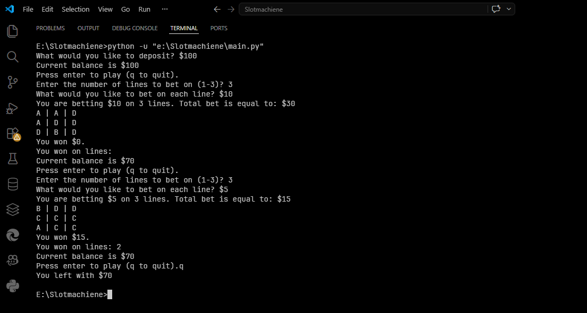

# 🎰 Python Slot Machine

A functional, text-based Slot Machine game built using Python. This project demonstrates core programming concepts including nested loops, dictionary management, random probability handling, and interactive user input validation.

---

## 🚀 Features

* **Dynamic Betting System**: Users can choose the number of lines to bet on (1-3) and the specific amount to wager per line.
* **Balance Management**: Includes a deposit system and real-time balance tracking that prevents users from betting more than they own.
* **Weighted Randomization**: The slot machine symbols have different frequencies (scarcity) and payout values, simulating real-world slot mechanics.
* **Win Logic**: Automatically checks for matching symbols across rows and calculates total winnings based on the symbol's multiplier and the user's bet.
* **Interactive CLI**: A clean command-line interface that allows players to continue spinning or quit with their remaining balance at any time.

## 📊 Game Mechanics

The machine uses a 3x3 grid with the following symbol distributions and values:

| Symbol | Frequency (Count) | Multiplier (Value) |
| :--- | :--- | :--- |
| **A** | 2 | 5x |
| **B** | 4 | 4x |
| **C** | 6 | 3x |
| **D** | 8 | 2x |

## 📸 Output Preview

> **Note**: To see this in your repository, replace C:\Users\USER\Desktop` with the actual path to your saved image.



## 🛠️ Technology Stack

* **Python 3.x**: The core programming language.
* **Random Module**: Used to simulate the unpredictability of the slot machine spins.

## 📁 Project Structure

* `main.py`: The primary source code containing all game logic, including `deposit()`, `get_bet()`, `spin()`, and `check_winnings()` functions.

---

## 💻 How to Run

1.  **Clone the Repository**:
    ```bash
    git clone [https://github.com/your-username/slot-machine-python.git](https://github.com/your-username/slot-machine-python.git)
    ```
2.  **Navigate to the Directory**:
    ```bash
    cd slot-machine-python
    ```
3.  **Run the Game**:
    ```bash
    python main.py
    ```

---

## 👤 Author

* **Name**: MH Nahid
* **Contact**: [Send an Email](mailto:mokbulhasannahid@gmail.com)